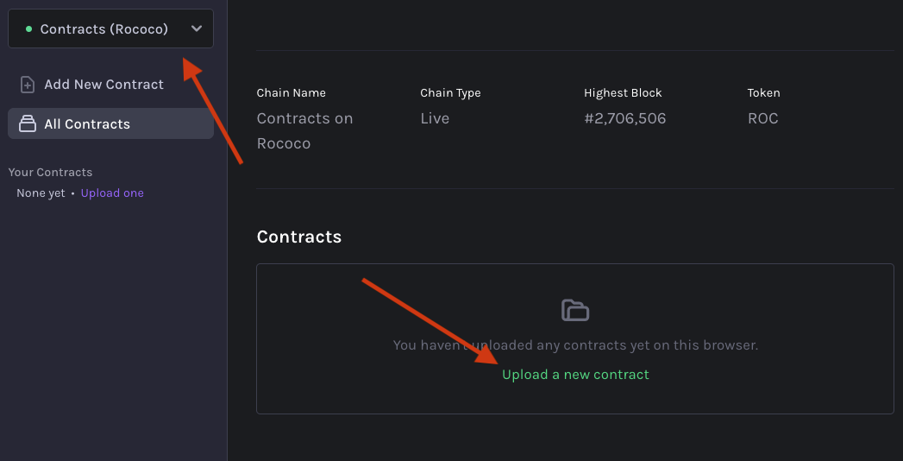
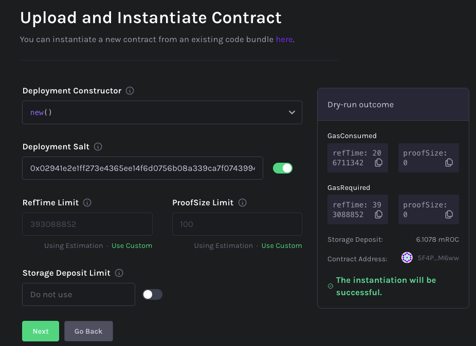

# Non-Fungible Assets with CO2 Emissions tracking.

[](https://github.com/paritytech/ink) [](https://github.com/paritytech/bcg-co2-passport/actions/workflows/ci.yml)

This smart contract is for tracking carbon emissions of steel. It is written in [ink!](https://github.com/paritytech/ink), a Rust based smart contract language for Substrate based blockchains.

-   [Non-Fungible Assets with CO2 Emissions tracking.](#non-fungible-assets-with-co2-emissions-tracking)
    -   [Contract Overview](#contract-overview)
    -   [Local development setup](#local-development-setup)
        -   [Rust and Cargo](#rust-and-cargo)
            -   [Cargo clippy linter](#cargo-clippy-linter)
        -   [ink! smart contract tools](#ink-smart-contract-tools)
        -   [pre-commit](#pre-commit)
            -   [Install the git hook script](#install-the-git-hook-script)
    -   [Local Deployment](#local-deployment)
        -   [Contracts Node](#contracts-node)
        -   [Smart Contract](#smart-contract)
        -   [Smart Contracts UI](#smart-contracts-ui)
    -   [Live Deployment](#live-deployment)
        -   [Deploying on Contracts on Rococo](#deploying-on-contracts-on-rococo)
    -   [Development](#development)
        -   [Format code](#format-code)
        -   [Run clippy linter](#run-clippy-linter)
        -   [Check that smart contracts build to WASM](#check-that-smart-contracts-build-to-wasm)
        -   [Testing](#testing)
        -   [Build smart contracts](#build-smart-contracts)
        -   [Run pre-commit](#run-pre-commit)
    -   [CI Jobs](#ci-jobs)
        -   [GitHub runners](#github-runners)
        -   [Jobs](#jobs)
    -   [Integration Tests](#integration-tests)
        -   [Running Integration Tests](#running-integration-tests)

## Contract Overview

This contract supports the following operations:

-   Updating contract.
-   Blasting an Asset - creating a new Asset with the CO2 Emissions required.
-   Adding additional CO2 Emissions to an Asset.
-   Transferring an Asset to a different account. Additional C02 Emissions always added.
-   Pausing an Asset to prevent transferring or adding new CO2 Emissions. This is a prerequisite to splitting an Asset.
-   Splitting an Asset into child Assets. The common reasons is due to actions like steel cutting.
-   Querying details about an Asset.
-   Querying the full parent tree of a child Asset. This allows for calculating the total CO2 Emissions a child Asset has.

## Local development setup

### Rust and Cargo

Follow the [instruction](https://doc.rust-lang.org/cargo/getting-started/installation.html) to install Rust and Cargo.

#### Cargo clippy linter

Follow the [instruction](https://github.com/rust-lang/rust-clippy#usage) to install `clippy`.

### ink! smart contract tools

Follow the [instruction](https://use.ink/getting-started/setup) to install `ink!` smart contract tools.

### pre-commit

Follow the [instruction](https://pre-commit.com/#installation) to install `pre-commit` tool.

#### Install the git hook script

```sh
pre-commit install
```

## Local Deployment

### Contracts Node

In a separated terminal start the Contracts Node:

```sh
substrate-contracts-node
```

### Smart Contract

Build Smart Contract:

```sh
cargo contract build --release
```

### Smart Contracts UI

1. Go to [Contracts UI](https://contracts-ui.substrate.io/).
1. Select `Upload a new contract`.
1. In `Upload and Instantiate` window:
    - Set contract name like `InfinityAsset`.
    - Upload contract details -> select `target/ink/asset_co2_emissions.contract` from the Smart Contract repository.
    - Press `Next` button.
    - Press `Next` button.
    - Press `Upload and Instantiate` button.
1. Interact with the Smart Contract.

## Live Deployment

There are several places where an ink! contract can be deployed! The [ink! documentation](https://use.ink/#where-can-i-deploy-ink-contracts) has an up-to-date list of where to deploy.

### Deploying on Contracts on Rococo

This example will be using [Contracts on Rococo](https://polkadot.js.org/apps/?rpc=wss%3A%2F%2Frococo-contracts-rpc.polkadot.io#/explorer) to deploy a contract.

1. Get testnet tokens using [this faucet](https://use.ink/faucet/).
2. Build the contract.

```sh
cargo contract build --release
```

3. Navigate to the Contracts page at [contracts-ui.substrate.io](https://contracts-ui.substrate.io/).
4. Ensure "Contracts (Rococo)" is selected.
   
5. Select `Upload a new contract`.
   
6. Upload the built contract found at `./target/ink/asset_co2_emissions.contract`. This file contains the contract Wasm bytecode and the metadata.
   
7. Click `Next`, modify the limits as desired. The default values are generally sufficient.
   
8. Click `Next` and finally `Upload and instantiate`.
9. The contract can now be used.

The documentation found [here](https://use.ink/testnet) provides more details and also instructions on how deploy contracts using `cargo contract`.

## Development

Below you can find some base commands, for more information check [official documentation](https://use.ink/).

### Format code

```sh
cargo +nightly fmt
```

### Run clippy linter

```sh
cargo +nightly clippy --all-features
```

### Check that smart contracts build to WASM

```sh
cargo contract check
```

### Testing

```sh
cargo test --features e2e-tests
```

### Build smart contracts

```sh
cargo contract build --release
```

### Run pre-commit

```sh
pre-commit run --all-files
```

## CI Jobs

This repository contains predefined GitHub actions for quality assurance.

### GitHub runners

-   Linux -> `ubuntu-20.04`

### Jobs

-   Formatting check -> `cargo +nightly fmt --check`
-   Linter check -> `cargo +nightly clippy --all-features`
-   Building smart contracts -> `cargo contract build`
-   Testing smart contracts -> `cargo test --features e2e-tests`
-   Integration tests -> `yarn test --exit`

## Integration Tests

The integration tests for this project are written using [Cucumber.js](https://cucumber.io/docs/installation/javascript/).

The tests are defined in [features/](./features/).
The following files describe the tests and user stories using [Gherkin Syntax](https://cucumber.io/docs/gherkin/):

-   [features/us1.feature](./features/us1.feature)
-   [features/us2.feature](./features/us2.feature)
-   [features/us3.feature](./features/us3.feature)

The test implementations are found in:

-   [features/support/steps.js](./features/support/steps.js): the test definitions using `Cucumber.js`.
-   [features/support/world.js](./features/support/world.js): the environment class used by the tests that manages interactions with Substrate and the contract.

### Running Integration Tests

From the project root

1. Install dependencies:

```
yarn
```

2. Start `substrate-contracts-node` using [v0.24.0](https://github.com/paritytech/substrate-contracts-node/releases/tag/v0.24.0)

```
substrate-contracts-node --dev
```

3. Run the tests:

```
yarn test --exit
```
